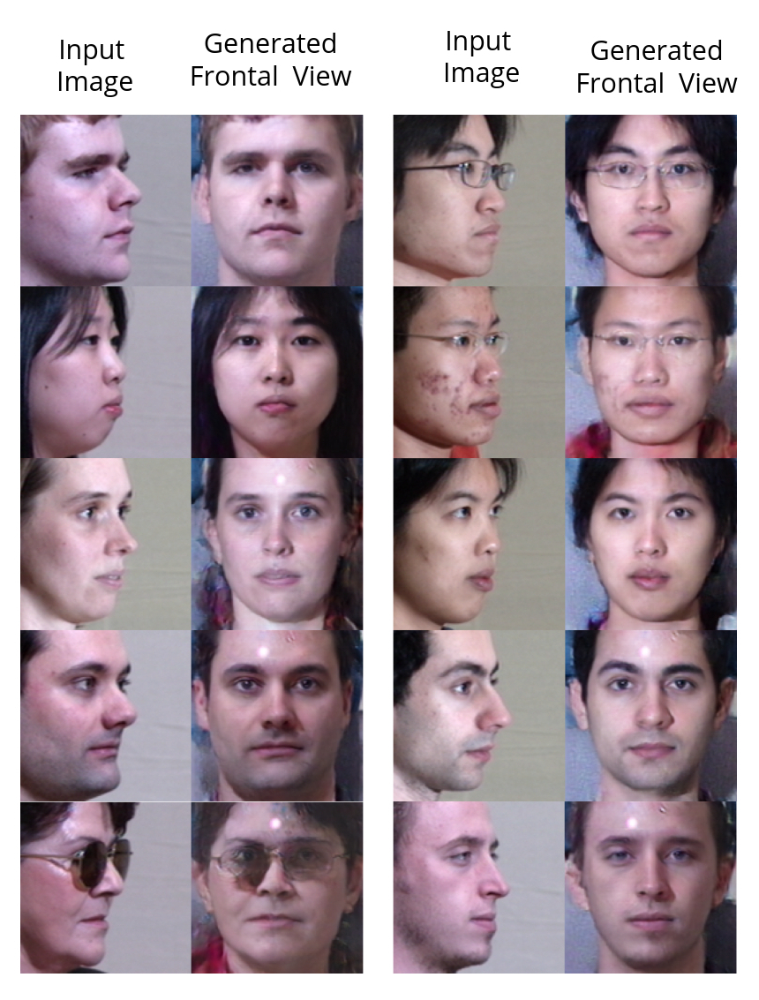

# Two-Pathway Generative Adversarial Networks

Pytorch implementation of ["Two-Pathway Generative Adversarial Networks"](https://arxiv.org/pdf/1704.04086.pdf)

The official implmentation of this paper can be found [here](https://github.com/HRLTY/TP-GAN)

Check the guide given in the original codebase to see how the dataset can be obtained

[LightCNN](https://github.com/AlfredXiangWu/LightCNN) was used to implement the architecture. 

